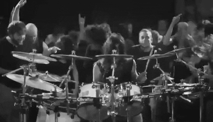

<h1 align="center"> Welcome stalkers of all shapes and sizes! 🤘️😈️🤘️ </h1>

  

<!--
**Naushikha/Naushikha** is a ✨ _special_ ✨ repository because its `README.md` (this file) appears on your GitHub profile.

Here are some ideas to get you started:

- 🔭 I’m currently working on ...
- 🌱 I’m currently learning ...
- 👯 I’m looking to collaborate on ...
- 🤔 I’m looking for help with ...
- 💬 Ask me about ...
- 📫 How to reach me: ...
- 😄 Pronouns: ...
- ⚡ Fun fact: ...
-->
<h2 align="center"> The Three Pillers of Life (According to Mine) </h2>

<table style="width:100%">
  <tr>
    <td>
      <figure>
        
        <figcaption>Metal</figcaption>
      </figure>
    </td>
    <td>
      <figure>
        
        <figcaption>Crazy coding</figcaption>
      </figure>
    </td>
    <td>
      <figure>
        
        <figcaption>Gaming</figcaption>
      </figure>
    </td>
  </tr>
</table>

